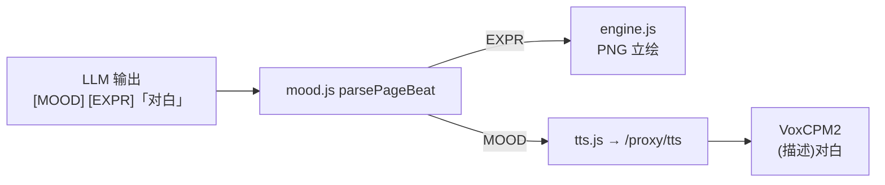

# AVG TTS（文本转语音）需求方案

> **编写目的**: 为 girlgame-skill AVG 接入 VoxCPM2 语音合成；初版以「月下长安」为例，现已扩展至四默认剧本。
> **目标读者**: 前端 / Python 维护者
> **状态**: 已实现（2026-05-24）— 四剧本 `ttsEnabled`、按 `assets/tts/{templateId}/` 分目录 Clone；流式叙事见 `stream.js`
>
> **运维速查**: [`docs/TTS.md`](TTS.md) · 资源 [`frontend/assets/tts/README.md`](../frontend/assets/tts/README.md)

## 环境变量

| 变量 | 说明 |
|------|------|
| `VOXCPM2_PATH` | VoxCPM2 模型目录，默认 `F:\ComfyUI_V6.0\...\VoxCPM2` |
| `TTS_BASE` | `server.js` 代理上游，默认 `http://localhost:7860` |

**启动：**

```bash
python frontend/server_tts.py
npm run dev
```

**健康检查：** `GET /proxy/tts/status` → 上游 `/tts/status`

## VoxCPM2 开源要点（[OpenBMB/VoxCPM](https://github.com/OpenBMB/VoxCPM)）

| 能力 | API 用法 | 本项目 |
|------|----------|--------|
| **Voice Design** | `text="(自然语言音色+情绪描述)对白正文"` | `server_tts.py` → `full_text = voice_desc + text` |
| **Controllable Clone** | `reference_wav_path` + 括号内风格指令 | **已用** — `assets/tts/{templateId}/voice_refs/{charId}.wav` |
| **情绪控制** | 描述中写明语气/情绪（如「语气压抑，带着悲伤」） | `VOICE_DESCRIPTIONS[charId][mood]` |
| **生成** | `VoxCPM.generate(text=..., cfg_value=2.0, inference_timesteps=10)` | 与官方 Quick Start 一致 |

**标准 MOOD（LLM / 前端 / TTS 三端一致）：**  
`neutral | warm | happy | sad | angry | cold | surprised | blush`

## 情绪数据流（已实现）



- **立绘**：`EXPR` 优先；缺省时 `MOOD → moodToExpression()` → `assets/portraits/{id}/{expr}.png`
- **语音**：`MOOD` → `get_voice_desc(charId, mood)` → VoxCPM2 括号描述
- **UI**：姓名栏显示 `角色名 · 情绪中文`；正文去掉 `[MOOD]`/`[EXPR]` 标签

## LLM 台词与 MOOD（AI 按剧情生成）

LLM 须在台词行输出（情绪须随剧情变化）：

```text
沈明月 [MOOD: warm] [EXPR: smile]「你怎么来了？」
```

前端 `mood.js` 解析；无 `[MOOD]` 时从关键词推断；`tts.js` 将 MOOD 映射为 VoxCPM2 `voice_desc`。

---

## 目录

1. [对话提取规则](#一对话提取规则)
2. [TTS 生成策略](#二tts-生成策略)
3. [前端 audio 层设计](#三前端-audio-层设计)
4. [VoxCPM2 音色描述方案](#四voxcpm2-音色描述方案)
5. [API 接口设计](#五api-接口设计)
6. [数据流总览](#六数据流总览)
7. [附录：代码文件清单](#七附录代码文件清单)

---

## 一、对话提取规则

### 1.1 目标

从 LLM 返回的文本（一个"页"）中，判断**是否有角色说话**，如有则提取出：
- `charId` — 角色标识符（如 `xieyunlan`）
- `dialogueText` — 对话原文（去除「」）
- `mood` — 情绪标签（如 `cold`），默认 `neutral`
- `voiceDesc` — 最终传入 VoxCPM2 的音色描述字符串

### 1.2 LLM 输出格式现状

```
谢云岚 [MOOD: cold]「此事与你无关，不必再问。」
```

或纯叙述（无角色名、无「」）：

```
夜色渐深，长安城的灯火在远处明明灭灭。
```

或混合（一段文字中既有角色名也有其它内容）：

```
花映月微微一笑 [MOOD: warm]「来了啊，我正等你呢。」她转身走向窗边。
```

### 1.3 提取算法

```python
import re

# 角色名 → charId 映射（与前端 PORTRAIT_CHARACTERS 保持一致）
CHARACTER_MAP = {
    '谢云岚': 'xieyunlan',
    '花映月': 'huayingyue',
    '顾千帆': 'guqianfan',
    '沈明月': 'shenmingyue',
    '李怀瑾': 'lihuaijin',
    '公孙兰': 'gongsunlan',
}

def extract_dialogue(page_text: str) -> dict | None:
    """
    从一页文本中提取对话信息。
    
    返回:
        {
            'charId': 'xieyunlan',
            'charName': '谢云岚',
            'dialogue': '此事与你无关，不必再问。',
            'mood': 'cold',
            'has_dialogue': True
        }
        或 None（纯旁白，不生成 TTS）
    """
    # Step 1: 检测角色名
    char_name = None
    for name in CHARACTER_MAP:
        if name in page_text:
            char_name = name
            break
    
    if not char_name:
        return None  # 没有角色名 → 纯旁白，跳过 TTS
    
    # Step 2: 提取对话内容（「」之间的文字）
    dialogues = re.findall(r'「([^」]*)」', page_text)
    if not dialogues:
        return None  # 有角色名但没有「」对话 → 旁白描述，跳过 TTS
    
    # Step 3: 取第一个「」中的内容（一页通常只有一句对话）
    dialogue_text = dialogues[0].strip()
    if not dialogue_text:
        return None
    
    # Step 4: 提取 [MOOD: xxx] 标签
    mood_match = re.search(r'\[MOOD:\s*(\w+)\]', page_text)
    mood = mood_match.group(1) if mood_match else 'neutral'
    
    # Step 5: 规范化 mood 值
    mood = normalize_mood(mood)
    
    return {
        'charId': CHARACTER_MAP[char_name],
        'charName': char_name,
        'dialogue': dialogue_text,
        'mood': mood,
        'has_dialogue': True,
    }


def normalize_mood(mood: str) -> str:
    """将 LLM 可能输出的各种情绪词归一到标准值"""
    mood_map = {
        'happy': 'happy', '开心': 'happy', '愉快': 'happy',
        'sad': 'sad', '悲伤': 'sad', '难过': 'sad',
        'angry': 'angry', '愤怒': 'angry', '生气': 'angry',
        'warm': 'warm', '温柔': 'warm', '温和': 'warm',
        'cold': 'cold', '冷漠': 'cold', '冰冷': 'cold',
        'surprised': 'surprised', '惊讶': 'surprised', '震惊': 'surprised',
        'neutral': 'neutral', '平静': 'neutral',
    }
    return mood_map.get(mood.lower(), 'neutral')
```

### 1.4 边界情况处理

| 情况 | 处理方式 |
|------|---------|
| 纯旁白（无角色名、无「」） | `extract_dialogue()` 返回 `None` → 跳过 TTS |
| 有角色名但无「」（如"谢云岚沉默不语"） | 返回 `None` → 跳过 TTS |
| 多个角色在一页中出现（极少见） | 只提取**第一个**角色名 + 第一个「」 |
| `[SCENE: xxx]` 标签 | 被前端 `detectScene()` 处理，TTS 层忽略 |
| `[MOOD: xxx]` 标签 | 被 `extract_dialogue()` 提取，映射到音色描述 |
| 情绪词不在 mood_map 中 | 默认 fallback 到 `neutral` |
| 对话含标点符号、古文 | 保持原样传给 TTS |
| 角色名在「」内部出现（如"「谢公子请留步」"） | `detectCharacter` 先匹配，仍能正常提取 |

### 1.5 与前端现有函数的协同

现有 `showPage()` 中的 `detectCharacter()` 和 `detectExpression()` **保持不变**，用于立绘切换。
TTS 层使用独立的 `extract_dialogue()` 函数，职责分离：

```
showPage(index)
  ├── detectScene(text)  →  切换背景
  ├── detectCharacter(text) →  切换立绘（已有逻辑，不改动）
  ├── detectExpression(text) →  切换表情（已有逻辑，不改动）
  ├── extract_dialogue(text) →  TTS 语音播放 ← 新增
  └── renderText(text) →  文字渲染
```

---

## 二、TTS 生成策略

### 2.1 总体策略：混合模式（预生成 + 实时降级）

**原则**:
1. 用户翻页时 **立即播放**语音，零等待
2. 语音文件**预先批量生成** + **按需增量生成**
3. 当前页优先播放，后台预加载后续页

### 2.2 文件命名与路径

```
assets/voices/{charId}_{pageIdx}.wav
# 示例：
assets/voices/xieyunlan_0.wav       # 谢云岚 第0页
assets/voices/huayingyue_3.wav      # 花映月 第3页
assets/voices/narration_2.wav        # （预留）旁白语音，当前方案跳过
```

**约定**:
- `{charId}`: 见 `CHARACTER_MAP` 中的 ID
- `{pageIdx}`: 当前 `turnCount` 下的页索引（全局唯一，因为 `currentPages` 每次 LLM 返回重置）
- 命名中的 `{pageIdx}` 使用**全局递增 ID**而非页内索引（见下方 2.3 节）

### 2.3 全局语音 ID 方案

为避免不同轮次间 page index 冲突，使用**全局单调递增 ID**:

```javascript
// 前端状态追加
let globalVoiceIdx = 0;     // 全局语音文件编号，单调递增
let voiceCache = {};        // { globalIdx: 'played' | 'loading' | 'ready' }
```

每次 `showPage()` 调用时：
```javascript
function showPage(index) {
  // ... 现有逻辑 ...
  
  // 新增：尝试播放语音
  const voiceIdx = indexToVoiceIdx(index);  // 从全局映射取
  if (voiceIdx !== null) {
    playVoice(voiceIdx);
  }
}
```

**更好的方案**: 让后端预生成后返回 `voiceIdx`，前端直接用。或者更简单——用 `turnCount_pageIndex` 作为 key：

```
# 命名规范（终版）
assets/voices/{charId}_{turnCount}_{pageInTurn}.wav
# 示例
assets/voices/xieyunlan_3_0.wav   # 第3轮对话，第0页
assets/voices/huayingyue_3_1.wav  # 第3轮对话，第1页
```

`turnCount` 和 `pageInTurn` 前端均有（`turnCount` + `currentPage`），无须额外状态。

### 2.4 生成触发方式

#### 方式 A：后端批量预生成（推荐，零前端改动）

```
游戏启动 / 首次进入场景
  └─→ Python 后端加载全量剧本 / 等待 LLM 输出
      └─→ 对每页调用 extract_dialogue()
          └─→ 如命中对话 → 调用 VoxCPM2 生成 .wav
              └─→ 写入 assets/voices/{charId}_{turnCount}_{pageIdx}.wav
```

**问题**: AVG 游戏的 LLM 输出是动态的，无法提前知道全部内容。

#### 方式 B：LLM 返回后即时生成（最终方案）

```
LLM 返回响应 → splitIntoPages()
  └─→ 对每一页（page 0..N-1）:
      ├── showPage(0) → 立即显示第 0 页
      │   └─→ extract_dialogue() → 有对话 → 播放已缓存的语音（如有）/ 触发即时生成
      └── 后台预生成 page 1..N-1 的语音
          └─→ 异步调用 Python TTS API
              └─→ 生成完写入 assets/voices/xxx.wav
```

#### 方式 C：HTTP API 实时生成（兜底降级）

如果语音文件尚未生成，前端直接请求 Python API 实时生成并返回音频流。
适用于首次游玩、冷启动场景。

### 2.5 最终策略：分阶段实现

| 阶段 | 方案 | 说明 |
|------|------|------|
| **Phase 1**（MVP） | HTTP API 实时生成 | 前端每翻一页，调用 `/tts` API 获取音频，播放 |
| **Phase 2**（优化） | 预生成 + 缓存 | LLM 返回后，后台线程批量生成后续页面的语音文件 |
| **Phase 3**（进阶） | 预加载 + 流式 | 翻页前预加载下一段音频到 `<audio>` buffer，实现零延迟 |

### 2.6 缓存策略

```python
import os
import hashlib

VOICE_DIR = "assets/voices"

def get_voice_path(char_id: str, turn_count: int, page_idx: int) -> str:
    """生成语音文件路径"""
    return os.path.join(VOICE_DIR, f"{char_id}_{turn_count}_{page_idx}.wav")

def voice_cache_key(char_id: str, dialogue: str, mood: str) -> str:
    """
    内容哈希缓存（更精确但更复杂）。
    如果对话内容不变但翻页顺序变了，仍能复用。
    """
    content = f"{char_id}|{mood}|{dialogue}"
    return hashlib.md5(content.encode('utf-8')).hexdigest()

def voice_file_exists(char_id: str, turn_count: int, page_idx: int) -> bool:
    """检查语音文件是否已生成"""
    return os.path.exists(get_voice_path(char_id, turn_count, page_idx))
```

**实际使用简化方案**: 文件名中嵌入页码元信息，不依赖内容哈希。若文件存在则直接播放，不存在则调用 API 生成。

### 2.7 异步预生成伪代码

```python
import asyncio
import os

async def pregenerate_voices(pages: list, turn_count: int):
    """
    在 LLM 返回后、用户翻页前，后台预生成所有页的语音。
    
    调用时机：
    sendMessage() 中的 splitIntoPages() 之后
    """
    tasks = []
    for page_idx, page_text in enumerate(pages):
        dialogue = extract_dialogue(page_text)
        if dialogue is None:
            continue  # 旁白，跳过
        voice_path = get_voice_path(dialogue['charId'], turn_count, page_idx)
        if os.path.exists(voice_path):
            continue  # 已有缓存
        tasks.append(
            generate_single_voice(dialogue, voice_path)
        )
    
    # 并发生成（最多 3 个并发，避免 GPU OOM）
    semaphore = asyncio.Semaphore(3)
    async def bounded_gen(dialog, path):
        async with semaphore:
            await generate_single_voice(dialog, path)
    
    await asyncio.gather(*[bounded_gen(d, p) for d, p in zip(tasks)])
```

---

## 三、前端 audio 层设计

### 3.1 HTML 结构（新增）

在 `game.html` 的 `<body>` 末尾、`</body>` 之前添加：

```html
<!-- TTS 语音播放器 -->
<audio id="ttsPlayer" preload="auto" style="display:none"></audio>

<!-- TTS 状态指示器（可选） -->
<div id="ttsIndicator" class="tts-indicator">♪</div>
```

### 3.2 CSS 样式（新增）

```css
/* TTS 状态指示器 */
.tts-indicator {
  position: fixed;
  bottom: 120px;
  right: 20px;
  font-size: 18px;
  color: rgba(200, 180, 255, .5);
  opacity: 0;
  transition: opacity .3s;
  pointer-events: none;
  z-index: 100;
  animation: ttsPulse 1.5s ease-in-out infinite;
  display: none;
}
.tts-indicator.active {
  opacity: 1;
  display: block;
}
@keyframes ttsPulse {
  0%, 100% { transform: scale(1); opacity: 0.5; }
  50% { transform: scale(1.15); opacity: 1; }
}
```

### 3.3 JavaScript TTS 模块

在 `game.html` 的 `<script>` 标签内追加：

```javascript
// ======================== TTS 系统 ========================

const TTS_CONFIG = {
  apiBaseUrl: 'http://localhost:7860',  // Python TTS API 地址
  voiceDir: 'assets/voices/',
  enabled: true,                        // 总开关
  autoPlay: true,                       // 翻页自动播放
  pregenNext: true,                     // 预加载下一页语音
};

const ttsPlayer = document.getElementById('ttsPlayer');
const ttsIndicator = document.getElementById('ttsIndicator');

let ttsCurrentSrc = '';       // 当前正在播放的语音 URL
let ttsPreloaded = null;      // 预加载的 Audio 对象


/**
 * 获取语音文件路径
 */
function getVoicePath(charId, turnCount, pageIdx) {
  return `${TTS_CONFIG.voiceDir}${charId}_${turnCount}_${pageIdx}.wav`;
}


/**
 * 从页面文本提取对话信息（前端版）
 * 与 Python 版 extract_dialogue() 逻辑一致
 */
function extractDialogueFromPage(pageText) {
  const charMap = {
    '谢云岚': 'xieyunlan', '花映月': 'huayingyue', '顾千帆': 'guqianfan',
    '沈明月': 'shenmingyue', '李怀瑾': 'lihuaijin', '公孙兰': 'gongsunlan',
  };

  // Step 1: 找角色名
  let charName = null;
  for (const name of Object.keys(charMap)) {
    if (pageText.includes(name)) {
      charName = name;
      break;
    }
  }
  if (!charName) return null;

  // Step 2: 找「」对话
  const match = pageText.match(/「([^」]*)」/);
  if (!match || !match[1].trim()) return null;

  // Step 3: 提取 MOOD
  const moodMatch = pageText.match(/\[MOOD:\s*(\w+)\]/);
  const mood = moodMatch ? moodMatch[1].toLowerCase() : 'neutral';

  return {
    charId: charMap[charName],
    charName: charName,
    dialogue: match[1].trim(),
    mood: mood,
  };
}


/**
 * 播放指定页的语音
 * 在 showPage() 末尾调用
 */
function playVoice(turnCount, pageIdx, pageText) {
  if (!TTS_CONFIG.enabled) return;

  const dialogue = extractDialogueFromPage(pageText);
  if (!dialogue) {
    // 旁白页，停止当前语音
    stopVoice();
    return;
  }

  const voicePath = getVoicePath(dialogue.charId, turnCount, pageIdx);

  // 尝试从预加载的 Audio 播放
  if (ttsPreloaded && ttsPreloaded.dataset.path === voicePath) {
    ttsPlayer.src = ttsPreloaded.src;
    ttsPlayer.play().catch(() => {});
    ttsPreloaded = null;
    showTtsIndicator(true);
    return;
  }

  // 尝试直接播放文件（可能 404，静默处理）
  ttsPlayer.src = voicePath;
  ttsPlayer.onerror = () => {
    // 文件不存在 → 调用 API 实时生成
    fetchTtsAndPlay(dialogue, voicePath);
  };
  ttsPlayer.play().catch(() => {
    // autoplay 被浏览器阻止或文件不存在
    fetchTtsAndPlay(dialogue, voicePath);
  });
  showTtsIndicator(true);
}


/**
 * 停止当前语音
 */
function stopVoice() {
  ttsPlayer.pause();
  ttsPlayer.currentTime = 0;
  showTtsIndicator(false);
}


/**
 * 预加载下一页语音
 */
function preloadNextVoice(turnCount, nextPageIdx, nextPageText) {
  if (!TTS_CONFIG.enabled || !TTS_CONFIG.pregenNext) return;

  const dialogue = extractDialogueFromPage(nextPageText);
  if (!dialogue) return;

  const voicePath = getVoicePath(dialogue.charId, turnCount, nextPageIdx);
  
  // 创建一个隐藏的 Audio 对象预加载
  const audio = new Audio();
  audio.preload = 'auto';
  audio.src = voicePath;
  audio.dataset.path = voicePath;
  
  // 加载成功后才保存为预加载对象
  audio.oncanplaythrough = () => {
    ttsPreloaded = audio;
  };
  audio.onerror = () => {
    // 文件不存在，留给 playVoice 时实时生成
  };
}


/**
 * TTS 状态指示器
 */
function showTtsIndicator(active) {
  ttsIndicator.classList.toggle('active', active);
}


/**
 * 通过 HTTP API 实时生成并播放语音（兜底方案）
 */
async function fetchTtsAndPlay(dialogue, targetPath) {
  try {
    const response = await fetch(`${TTS_CONFIG.apiBaseUrl}/tts`, {
      method: 'POST',
      headers: { 'Content-Type': 'application/json' },
      body: JSON.stringify({
        char_id: dialogue.charId,
        text: dialogue.dialogue,
        mood: dialogue.mood,
      }),
    });

    if (!response.ok) throw new Error('TTS API error');

    // 方案 A: 返回音频 Blob（推荐，零延迟）
    const blob = await response.blob();
    const url = URL.createObjectURL(blob);
    ttsPlayer.src = url;
    ttsPlayer.play().catch(() => {});
    showTtsIndicator(true);

    // 可选：后台保存文件供后续复用
    // saveBlobToFile(blob, targetPath);

  } catch (e) {
    console.warn('TTS 生成失败（静默降级）:', e.message);
    // 不阻塞游戏，只是没有语音
  }
}
```

### 3.4 showPage() 集成改动

只改 `showPage()` 函数的末尾，追加两行：

```javascript
function showPage(index) {
  // ... 现有全部逻辑（场景、角色、表情、渲染）不变 ...
  
  // ==== TTS 集成（仅追加） ====
  playVoice(turnCount, index, text);
  
  // 预加载下一页语音
  const nextIdx = index + 1;
  if (nextIdx < pages.length) {
    preloadNextVoice(turnCount, nextIdx, pages[nextIdx]);
  }
}
```

### 3.5 advancePage() 集成

翻页时停止当前语音：

```javascript
function advancePage() {
  // ... 现有逻辑 ...
  
  // 停止当前语音（追加一行）
  stopVoice();
  
  // ... 后续翻页逻辑 ...
}
```

### 3.6 自动播放策略

| 情况 | 行为 |
|------|------|
| 用户翻到新页 | `playVoice()` → 立即播放 |
| 用户快速连翻 | `stopVoice()` 中断当前语音 → 播放新页语音 |
| 旁白页（无对话） | 停止当前语音，静默 |
| 语音文件不存在 | 兜底调用 HTTP API 实时生成 |
| API 也不可用 | 静默降级，游戏正常进行 |
| 浏览器阻止 autoplay | `play()` 的 `.catch()` 静默处理 |

---

## 四、VoxCPM2 音色描述方案

### 4.1 核心原理

VoxCPM2 的 Voice Design 功能：在 `text` 参数开头用括号描述音色。

```python
wav = model.generate(
    text="(年轻女声，温柔)你好，欢迎。",
    cfg_value=2.0,
    inference_timesteps=10,
)
```

括号中的描述词可以是：性别、年龄、语气、情绪、语速、音调等自然语言描述。

### 4.2 6 角色音色配置表

每个角色定义一组**基础音色描述** + **情绪修饰后缀**。

#### 基础音色描述

| 角色 | charId | 基础音色描述（中文） | 基础音色描述（英文，备用） |
|------|--------|---------------------|---------------------------|
| 谢云岚 | `xieyunlan` | `(冷峻青年男声，沉稳低沉，语气平静)` | `(young male voice, calm and low, steady tone)` |
| 花映月 | `huayingyue` | `(年轻女声，妩媚柔美，语速稍慢)` | `(young female voice, charming and gentle, slightly slow)` |
| 沈明月 | `shenmingyue` | `(成熟女声，清冷御姐，干脆利落)` | `(mature female voice, cool and crisp, assertive)` |
| 李怀瑾 | `lihuaijin` | `(青年男声，温润如玉，儒雅平和)` | `(young male voice, warm and refined, gentle scholar)` |
| 顾千帆 | `guqianfan` | `(磁性低沉男声，洒脱不羁，略带慵懒)` | `(deep magnetic male voice, free-spirited, slightly lazy)` |
| 公孙兰 | `gongsunlan` | `(成熟女声，慵懒淡雅，从容淡定)` | `(mature female voice, leisurely and elegant, calm)` |

#### 情绪 → 音色修饰映射

| MOOD 标签 | 情绪描述 | 修饰词（追加到基础描述末尾） |
|-----------|---------|---------------------------|
| `neutral` | 中性/平静 | `，语气平静` |
| `happy` | 开心 | `，语气欢快，语速稍快，音调升高` |
| `sad` | 悲伤 | `，语气低沉悲伤，语速放慢` |
| `angry` | 愤怒 | `，语气冷厉愤怒，语速较快，音调压低` |
| `warm` | 温柔 | `，语气温柔亲切，语速适中` |
| `cold` | 冷漠 | `，语气冰冷疏离，毫无感情波动` |
| `surprised` | 惊讶 | `，语气惊讶，语速稍快，音调升高` |

### 4.3 最终音色描述拼接函数

```python
def build_voice_description(char_id: str, mood: str = 'neutral') -> str:
    """
    拼接 VoxCPM2 音色描述。
    
    输入: char_id='xieyunlan', mood='cold'
    输出: "(冷峻青年男声，沉稳低沉，语气冰冷疏离，毫无感情波动)"
    """
    base_voices = {
        'xieyunlan': '冷峻青年男声，沉稳低沉',
        'huayingyue': '年轻女声，妩媚柔美',
        'shenmingyue': '成熟女声，清冷御姐',
        'lihuaijin': '青年男声，温润如玉',
        'guqianfan': '磁性低沉男声，洒脱不羁',
        'gongsunlan': '成熟女声，慵懒淡雅',
    }
    
    mood_modifiers = {
        'neutral': '语气平静',
        'happy': '语气欢快，语速稍快',
        'sad': '语气低沉悲伤，语速放慢',
        'angry': '语气冷厉愤怒',
        'warm': '语气温柔亲切',
        'cold': '语气冰冷疏离，毫无感情波动',
        'surprised': '语气惊讶，语速稍快',
    }
    
    base = base_voices.get(char_id, '平静语气')
    modifier = mood_modifiers.get(mood, '语气平静')
    
    return f"({base}，{modifier})"


def build_tts_text(char_id: str, dialogue: str, mood: str = 'neutral') -> str:
    """
    生成最终传给 VoxCPM2 的 text 参数。
    
    示例返回值:
    "(冷峻青年男声，沉稳低沉，语气冰冷疏离，毫无感情波动)此事与你无关，不必再问。"
    """
    voice_desc = build_voice_description(char_id, mood)
    return f"{voice_desc}{dialogue}"
```

### 4.4 生成示例

```python
# 谢云岚，冷漠
text = build_tts_text('xieyunlan', '此事与你无关，不必再问。', 'cold')
# → "(冷峻青年男声，沉稳低沉，语气冰冷疏离，毫无感情波动)此事与你无关，不必再问。"

# 花映月，开心
text = build_tts_text('huayingyue', '来了啊，我正等你呢。', 'warm')
# → "(年轻女声，妩媚柔美，语气温柔亲切)来了啊，我正等你呢。"

# 顾千帆，中性
text = build_tts_text('guqianfan', '这伤不重，三天便能好。', 'neutral')
# → "(磁性低沉男声，洒脱不羁，语气平静)这伤不重，三天便能好。"
```

### 4.5 VoxCPM2 调用封装

```python
import os
import soundfile as sf
from voxcpm import VoxCPM

class TTSGenerator:
    """VoxCPM2 TTS 生成器封装"""
    
    def __init__(self, model_path: str, device: str = 'cuda'):
        self.model = VoxCPM.from_pretrained(model_path, load_denoiser=False)
        self.model.to(device)
        self.sample_rate = self.model.tts_model.sample_rate  # 48kHz
        self.output_dir = 'assets/voices'
        os.makedirs(self.output_dir, exist_ok=True)
    
    def generate(self, char_id: str, dialogue: str, mood: str = 'neutral',
                 output_path: str = None) -> str:
        """
        生成语音文件。
        
        参数:
            char_id: 角色ID
            dialogue: 对话文本
            mood: 情绪标签
            output_path: 输出路径，None 则自动生成
        
        返回:
            生成的文件路径
        """
        text = build_tts_text(char_id, dialogue, mood)
        
        wav = self.model.generate(
            text=text,
            cfg_value=2.0,
            inference_timesteps=10,
        )
        
        if output_path is None:
            output_path = os.path.join(self.output_dir, f"{char_id}_temp.wav")
        
        sf.write(output_path, wav, self.sample_rate)
        return output_path
    
    def generate_async(self, char_id: str, dialogue: str, mood: str,
                       output_path: str) -> None:
        """异步生成（在线程池中调用）"""
        # 实际使用中，用 asyncio + ThreadPoolExecutor 包装
        self.generate(char_id, dialogue, mood, output_path)
```

---

## 五、API 接口设计

### 5.1 架构选择

由于 ComfyUI 的 Python 运行在 **Windows 原生环境**，而游戏前端是 **WSL 中的浏览器**，选择 **HTTP API 方案**是最通用的。

```
┌─────────────────┐      HTTP POST /tts       ┌──────────────────────┐
│  前端 (WSL)      │  ─────────────────────→   │  Python TTS Server   │
│  game.html       │  ←─────────────────────   │  (Windows, :7860)    │
│  Chromium/Firefox│    返回 audio/wav blob     │  FastAPI / Flask     │
└─────────────────┘                            └──────────────────────┘
```

### 5.2 API 端点设计

#### `POST /tts` — 实时生成语音

```python
# ============ Python 后端 (app.py) ============

from fastapi import FastAPI, HTTPException
from fastapi.responses import Response
from pydantic import BaseModel
import io

app = FastAPI()
tts = TTSGenerator(r"F:\ComfyUI_V6.0\ComfyUI-WorkFisher-V2\ComfyUI\models\VoxCPM2")

class TTSRequest(BaseModel):
    char_id: str       # 角色 ID，如 'xieyunlan'
    text: str          # 对话文本，如 '此事与你无关'
    mood: str          # 情绪标签，如 'cold'，默认 'neutral'
    save_cache: bool   # 是否保存到磁盘缓存，默认 True

class TTSResponse(BaseModel):
    # 如果返回 JSON
    path: str          # 语音文件路径
    duration: float    # 音频时长（秒）

@app.post("/tts")
async def generate_tts(request: TTSRequest):
    """
    实时生成 TTS 语音，返回 WAV 音频流。
    """
    try:
        wav, sr = tts.generate_raw(
            char_id=request.char_id,
            dialogue=request.text,
            mood=request.mood or 'neutral',
        )
        
        # 可选：保存到磁盘缓存
        if request.save_cache:
            cache_path = ...  # 根据 turnCount/pageIdx 生成
            sf.write(cache_path, wav, sr)
        
        # 返回 WAV 字节流
        buf = io.BytesIO()
        sf.write(buf, wav, sr, format='WAV')
        buf.seek(0)
        
        return Response(
            content=buf.read(),
            media_type='audio/wav',
            headers={
                'X-Duration': f'{len(wav) / sr:.2f}',
            }
        )
    
    except Exception as e:
        raise HTTPException(status_code=500, detail=str(e))


@app.post("/tts/pregen")
async def pregenerate_tts(request: TTSRequest):
    """
    预生成语音文件，存入磁盘。不返回音频流。
    
    请求体同 /tts，多一个 page_path 字段。
    """
    # 生成并保存到 assets/voices/{charId}_{turnCount}_{pageIdx}.wav
    ...


@app.get("/tts/status")
async def tts_status():
    """检查 TTS 服务是否可用"""
    return {
        'status': 'ok',
        'model': 'VoxCPM2',
        'device': 'cuda',
        'characters': list(CHARACTER_MAP.keys()),
    }
```

### 5.3 前端 fetch 封装（已见 3.3 节）

```javascript
// 前端调用示例
async function fetchTtsAndPlay(dialogue, targetPath) {
  const response = await fetch('http://localhost:7860/tts', {
    method: 'POST',
    headers: { 'Content-Type': 'application/json' },
    body: JSON.stringify({
      char_id: dialogue.charId,
      text: dialogue.dialogue,
      mood: dialogue.mood,
      save_cache: true,
    }),
  });
  
  const blob = await response.blob();
  const url = URL.createObjectURL(blob);
  ttsPlayer.src = url;
  ttsPlayer.play();
}
```

### 5.4 启动脚本

```batch
:: start-tts-server.bat (放在 girlgame-skill 根目录)
@echo off
echo 启动月下长安 TTS 服务...
cd /d F:\Hermes\girlgame-skill
F:\ComfyUI_V6.0\ComfyUI-WorkFisher-V2\Python3.12.6\python.exe backend\tts_server.py
```

```python
# backend/tts_server.py
import uvicorn

if __name__ == '__main__':
    uvicorn.run(
        'app:app',
        host='0.0.0.0',
        port=7860,
        reload=False,
        log_level='info',
    )
```

### 5.5 服务发现

前端 API 地址配置：

```javascript
// 开发环境：直接连 localhost
// 部署时可能需要改为 Windows 主机的 IP
const TTS_API_BASE = 'http://localhost:7860';

// 通过 GET /tts/status 健康检查
async function checkTtsAvailability() {
  try {
    const resp = await fetch(`${TTS_API_BASE}/tts/status`);
    return resp.ok;
  } catch {
    return false;
  }
}
```

---

## 六、数据流总览

### 6.1 完整请求-响应流程

```
用户输入文字
    │
    ▼
callLLM() → DeepSeek API
    │
    ▼
LLM 返回文本 → splitIntoPages()
    │
    ├── page[0] → showPage(0)
    │       ├── detectScene() → bg
    │       ├── detectCharacter() → sprite
    │       ├── detectExpression() → expression
    │       ├── renderText() → 显示文字
    │       ├── extractDialogue() → {charId, dialogue, mood}
    │       │      └── 命中? → playVoice()
    │       │            ├── 文件存在? → 直接播放
    │       │            └── 文件不存在? → POST /tts → 生成并播放
    │       └── preloadNextVoice(page[1]) → 后台预加载
    │
    ├── page[1..N-1] → (后台) 批量调用 POST /tts/pregen → 生成 .wav 文件
    │
    ▼
用户翻页 → advancePage() → stopVoice() → showPage(1) → 同上
    │
    ▼
所有页显示完 → showChoices() → 用户选择 → 循环
```

### 6.2 文件目录结构（新增部分）

```
girlgame-skill/
├── backend/
│   ├── app.py               ← FastAPI TTS 服务
│   ├── tts_server.py         ← 启动入口
│   ├── tts_generator.py      ← TTSGenerator 类封装
│   ├── tts_extract.py        ← extract_dialogue() + build_voice_description()
│   └── requirements.txt      ← 依赖（fastapi, uvicorn, voxcpm, soundfile）
├── frontend/
│   ├── game.html             ← 追加 TTS 模块（~80行 JS）
│   └── assets/
│       └── voices/           ← 生成的 .wav 文件存放目录（自动创建）
│           ├── xieyunlan_0_0.wav
│           ├── huayingyue_0_1.wav
│           └── ...
├── start-tts-server.bat      ← 一键启动 TTS 服务
└── docs/
    └── tts-plan.md           ← 本文档
```

---

## 七、附录：代码文件清单

### 7.1 需要新增的文件

| 文件 | 说明 | 实现者 |
|------|------|--------|
| `backend/tts_generator.py` | `TTSGenerator` 类，封装 VoxCPM2 调用 | 茱莉 |
| `backend/tts_extract.py` | `extract_dialogue()` + `build_voice_description()` + `build_tts_text()` | 茱莉 |
| `backend/app.py` | FastAPI 应用，`/tts` 和 `/tts/pregen` 端点 | 茱莉 |
| `backend/tts_server.py` | uvicorn 启动脚本 | 茱莉 |
| `backend/requirements.txt` | fastapi, uvicorn, voxcpm, soundfile, pydantic | 茱莉 |
| `start-tts-server.bat` | Windows 一键启动脚本 | 茱莉 |

### 7.2 需要修改的文件

| 文件 | 修改内容 | 实现者 |
|------|---------|--------|
| `frontend/game.html` | 追加 TTS 模块（~80行 JS）+ `<audio>` 元素 + 样式 | 火舞 |

### 7.3 Phase 分步实施计划

| Phase | 内容 | 预计工时 |
|-------|------|---------|
| **Phase 1** | 后端 `app.py` + `tts_generator.py` + `extract_dialogue()` | 2h |
| | 前端 `<audio>` + `playVoice()` + `fetchTtsAndPlay()` | 1h |
| | 联调：翻页 → API 生成 → 播放 | 1h |
| **Phase 2** | 预生成 `POST /tts/pregen` + 文件缓存 | 1.5h |
| | 前端 `preloadNextVoice()` | 1h |
| **Phase 3** | 预加载优化 + 无语音降级测试 | 1h |
| | **总计** | **7.5h** |
